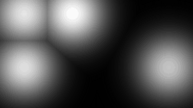
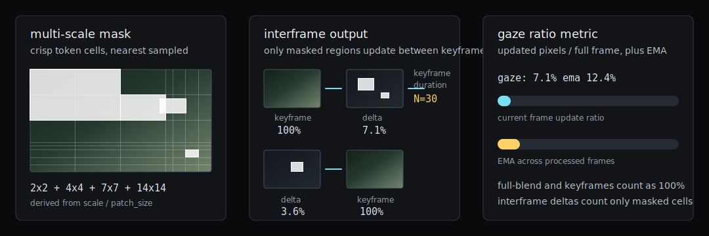

# burn_autogaze 🔥👁️🎯

[](https://github.com/mosure/burn_autogaze/actions?query=workflow%3Atest)
[](https://github.com/mosure/burn_autogaze/actions?query=workflow%3A%22deploy+github+pages%22)
[](https://crates.io/crates/burn_autogaze)
[](https://docs.rs/burn_autogaze)

burn-native [nvidia autogaze](https://huggingface.co/nvidia/AutoGaze) model
inference, fixation traces, crisp multi-scale token-cell mask visualization, and
bevy/webgpu demos.

| input | multi-scale mask | alpha-blended output |
|---|---|---|
|  |  |  |



## vibes

- lowercase, small, practical burn crate for gaze inference
- loads hugging face `config.json` + `model.safetensors`
- default fast path downsamples frames to the model's `224` input
- optional tiled full-resolution mode remaps local 224px tile predictions and
  token-cell extents back into source-frame coordinates
- white mask and output visualizations preserve the model's multi-scale
  `2x2`/`4x4`/`7x7`/`14x14` token cells with nearest sampling
- optional `interframe` visualization updates only masked cells between
  configurable keyframes, emulating an interframe video-encoding preview
- bevy overlay can show FPS plus gaze/update ratio with per-frame and EMA
  percentages
- runs on ndarray, webgpu, cuda, and wasm/webgpu
- ships a plain wasm-bindgen api plus a symmetric native/wasm bevy viewer

## burn support

| burn_autogaze | burn | burn-store | status |
|---|---:|---:|---|
| `0.21.x` | `0.21.x` | `0.21.x` | current |
| `<0.21` | `<0.21` | `<0.21` | not supported in this repo |

## features

| feature | default | target | notes |
|---|---:|---|---|
| `ndarray` | yes | native | cpu reference backend |
| `webgpu` | yes | native/web | burn webgpu/wgsl backend |
| `wgpu` | no | native/web | burn wgpu backend without selecting the webgpu compiler feature |
| `cuda` | no | native | cuda backend |
| `wasm` | no | wasm32 | wasm-bindgen api over burn webgpu |
| `bevy-web-demo` | no | wasm32 | compatibility alias for demo builds |

## usage

```rust,no_run
use burn::backend::{wgpu, WebGpu};
use burn_autogaze::{
    AutoGazeClipShape, AutoGazeInferenceMode, AutoGazePipeline, AutoGazeRgbaClipShape,
};

let device = wgpu::WgpuDevice::default();
wgpu::init_setup::<wgpu::graphics::AutoGraphicsApi>(&device, Default::default());

let pipeline = AutoGazePipeline::<WebGpu>::from_hf_dir("/path/to/AutoGaze", &device)?
    .with_max_gaze_tokens_each_frame(8);

// frames are [time, channels, height, width], normalized as f32
let shape = AutoGazeClipShape::new(2, 3, 720, 1280);
let frames = vec![0.0; shape.num_values()];

let trace = pipeline.trace_clip_from_frames_with_mode(
    &frames,
    shape,
    4,
    AutoGazeInferenceMode::ResizeToModelInput,
)?;

let tiled_trace = pipeline.trace_clip_from_frames_with_mode(
    &frames,
    shape,
    4,
    AutoGazeInferenceMode::tiled_model_input(224),
)?;

let rgba = vec![0_u8; shape.clip_len * shape.height * shape.width * 4];
let rgba_trace = pipeline.trace_rgba_clip_with_mode(
    &rgba,
    AutoGazeRgbaClipShape::new(shape.clip_len, shape.height, shape.width),
    4,
    AutoGazeInferenceMode::ResizeToModelInput,
    &device,
)?;

# Ok::<(), anyhow::Error>(())
```

`ResizeToModelInput` is the recommended realtime path. `TiledFullResolution`
keeps local full-res evidence, but it is much slower because every covered tile
runs through the model.

## visualization

| mode | output behavior | update ratio |
|---|---|---|
| `full-blend` | redraws the current input with a white alpha-blended mask | `100%` |
| `interframe` | keeps prior output outside the current mask and redraws a full keyframe every `keyframe-duration` frames | masked-cell pixels / full-frame pixels, or `100%` on keyframes |

AutoGaze emits multi-scale token positions. For the NVIDIA config, the Rust
trace decoder maps those tokens back to `2x2`, `4x4`, `7x7`, and `14x14`
source-frame cells, then renders the mask with nearest sampling so the
quad-tree-like cell structure stays crisp.

The gaze ratio metric reports how much of the output frame changed compared to
a full-frame redraw. The Bevy overlay shows the current frame ratio plus an EMA
across processed frames.

## wasm

```sh
cd web
npm run build:wasm
npm run serve
```

`WasmAutoGaze.create(configJson, safetensors)` loads `config.json` plus
`model.safetensors` bytes through async WebGPU setup, accepts RGBA video clips,
and returns white binary token-cell mask, alpha-blended, and `input | mask |
output` RGBA buffers (`output_rgba()` is the preferred accessor, with
`blend_rgba()` kept for compatibility). outputs also expose mask/update pixel
counts and ratios. use `set_visualization_mode("interframe")` and
`set_keyframe_duration(n)` to enable stateful interframe output. this is the
low-level wasm-bindgen api demo.

## bevy

```sh
cargo run -p bevy_burn_autogaze --features native -- --mode resize-224 --visualization-mode full-blend
cargo run -p bevy_burn_autogaze --features native -- --mode tile-224 --visualization-mode interframe --keyframe-duration 30

cd crates/bevy_burn_autogaze
npm run build:wasm
npm run serve
```

`bevy_burn_autogaze` is the primary UI demo on both native and wasm. native and
browser builds render the same bevy app: the only platform split is camera/model
I/O (`nokhwa` or `--image-path` natively, browser camera plus `frame_input` on
wasm). both modes show the same bevy-rendered `input | mask | output`
visualization plus toggleable FPS and gaze/update-ratio overlays.

Set `--show-fps=false` or `--show-gaze-ratio=false` to hide either text overlay.

The native app accepts CLI flags; the wasm app accepts the same viewer/inference
knobs through query parameters:

```text
http://localhost:8080/?mode=tile-224&visualization-mode=interframe&keyframe-duration=30&top-k=2&frames-per-clip=2&show-fps=true&show-gaze-ratio=true
```

For headless browsers or machines without a webcam, run the same Bevy UI from a
static source:

```text
http://localhost:8080/?source=static&frames-per-clip=1
http://localhost:8080/?image-url=./frame.png&frames-per-clip=1
```

The web build fetches NVIDIA AutoGaze from Hugging Face by default. override
URLs with `config-url` and `weights-url` query parameters. the bevy crate pins
bevy to
`ae2fcc0353d95e887470f0f6fc8a7e434e5549ce` so burn and bevy resolve through
`wgpu` v29.

## benches

```sh
cargo bench --bench backend_pipeline --features webgpu
cargo bench --bench backend_pipeline --features cuda
AUTOGAZE_HF_DIR=/path/to/AutoGaze cargo bench --bench backend_pipeline --features cuda -- autogaze_real_trace_video
```

the benchmark suite covers full-resolution source clips (`1280x720` and
`1920x1080`), `resize-224`, `tile-224`, embedding, trace generation, and a
real-model group when the autogaze hugging face snapshot is available. synthetic
backend benches run the full matrix across `single-scale-224` and
`multiscale-32-64-112-224` model layouts, so tiled full-resolution runs are
measured with the same multi-scale gaze-token layout used by the NVIDIA config.
the visualization group also measures `full-blend`, `interframe-keyframe`, and
`interframe-delta` output paths for single-scale and multi-scale crisp masks.

useful filters:

```sh
cargo bench --bench backend_pipeline -- autogaze_trace_video/webgpu/multiscale-32-64-112-224/tile-224
cargo bench --bench backend_pipeline -- autogaze_visualization/multiscale-32-64-112-224/interframe-delta
```

## validation

```sh
cargo test
cargo test --features cuda --test backend_pipeline -- --nocapture
cargo clippy --all-targets --features cuda -- -D warnings
cargo check --target wasm32-unknown-unknown --no-default-features --features wasm
cargo package --allow-dirty
```

cuda/webgpu backend tests and benches skip cleanly when the requested
accelerator is not available on the host.
